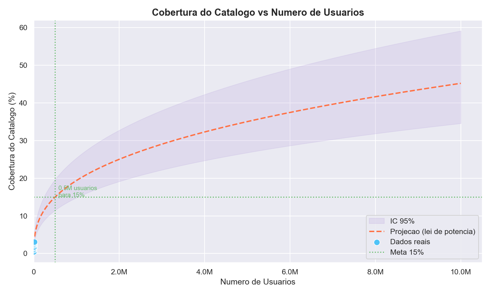
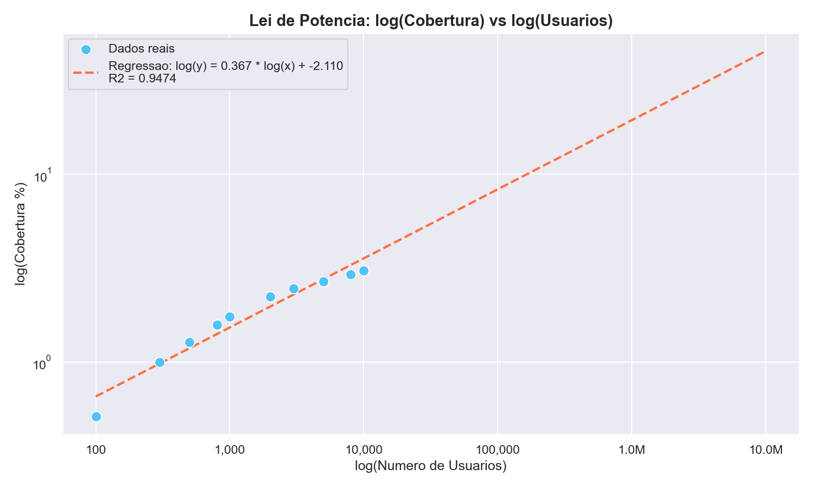
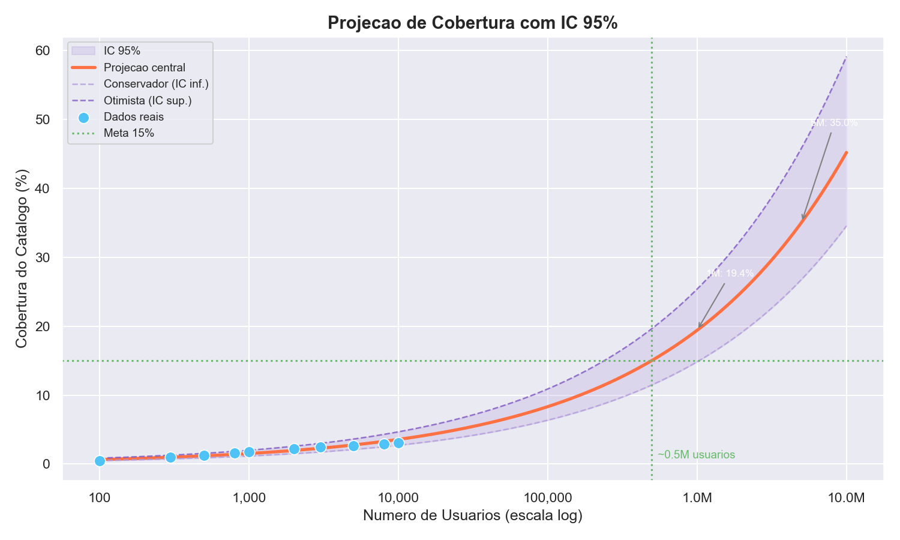

🏗️ PIPELINE COMPLETA (6 FASES)

- **FASE 0: PLANEJAMENTO**: Definição do problema de negócio, requisitos e arquitetura do sistema.
- **FASE 1: FUNDAÇÃO (BD)**: Modelagem e criação do banco de dados PostgreSQL com 122k jogos.
- **FASE 2: EXPLORAÇÃO (EDA)**: Análise profunda de dados para extrair insights e preparar features.
- **FASE 3: BACKEND MÍNIMO**: Desenvolvimento da API robusta com FastAPI para servir o modelo.
- **FASE 4: MODELAGEM (IA/Recomendação)**: Treinamento e ajuste dos modelos de ML (RF, KMeans, LightFM, cGAN).
- **FASE 5: EXPERIMENTAÇÃO**: Otimização de hiperparâmetros e versionamento com MLflow e Optuna.
- **FASE 6: APRESENTAÇÃO (PORTFOLIO)**: Documentação final, entrega e visualização de resultados.

# 🎮 Killswitch Engage – Sistema Inteligente de Recomendação de Jogos

[](https://www.python.org/)
[](https://fastapi.tiangolo.com/)
[](https://pytorch.org/)
[](https://scikit-learn.org/)
[](https://making.lyst.com/lightfm/docs/home.html)
[](https://www.postgresql.org/)
[](https://redis.io/)
[](https://www.docker.com/)
[](https://mlflow.org/)
[](https://optuna.org/)
[](LICENSE)

---

## 📌 1. Visão Geral

**Killswitch Engage** é um sistema completo de recomendação de jogos, construído do zero com ML em produção como objetivo central. O pipeline abrange desde a ingestão e limpeza de **122.507 jogos da Steam** até uma API em produção com latência < 15ms, passando por modelos de aprendizado de máquina treinados sobre **10.000 usuários sintéticos** com histórico realista de sessões.

### 🔍 O Problema

A Steam possui mais de 50.000 jogos no catálogo. Um usuário novo se perde. Um usuário experiente fica preso em uma "bolha" dos mesmos gêneros. O desafio: recomendar o jogo certo, para a pessoa certa, no momento certo — lidando com **cold start**, **viés de popularidade**, **dados esparsos** e **escalabilidade**.

### 💡 A Solução

Uma arquitetura de **4 camadas em cascata**:

```
[Entrada: Perfil do Usuário]
         │
         ▼
 ┌─────────────────┐
 │  Camada 1: RF   │  → Classificador (RandomForest) filtra jogos relevantes
 │  (Filtro)       │     com base em features de conteúdo (gênero, preço, tags)
 └────────┬────────┘
          │
          ▼
 ┌─────────────────┐
 │  Camada 2:      │  → Clustering (KMeans / HDBSCAN) identifica o arquétipo
 │  Clustering     │     de usuário (casual, médio, hardcore)
 └────────┬────────┘
          │
          ▼
 ┌─────────────────┐
 │  Camada 3:      │  → LightFM (Ranking Hybrid) ranqueia os candidatos por
 │  LightFM Ranker │     colaboratividade + features de conteúdo
 └────────┬────────┘
          │
          ▼
 ┌─────────────────┐
 │  Camada 4: cGAN │  → Meta-aprendizado por modo (conservador/equilibrado/
 │  (Meta-Learner) │     aventureiro) com threshold e exploração calibrados
 └─────────────────┘
          │
          ▼
  [API FastAPI + Cache Redis]
```

---

## ✨ 2. Funcionalidades

- ✅ **Recomendações personalizadas** baseadas em perfil completo de usuário
- ✅ **3 modos de recomendação**: Conservador (precisão), Equilibrado (padrão), Aventureiro (exploração)
- ✅ **Cold start** para novos usuários — fallback por popularidade + cluster de arquétipo
- ✅ **API rápida** com latência < 15ms e cache Redis nas rotas analíticas (TTL 1h)
- ✅ **Pipeline completo de dados** com imputação inteligente validada (KS-test p = 1.0)
- ✅ **MLOps integrado**: experimentos versionados com MLflow + otimização Bayesiana (Optuna, 20 trials)
- ✅ **Análise de cobertura com Lei de Potência** (R² = 0.9474): escalabilidade comprovada matematicamente
- ✅ **Segurança**: credenciais por variáveis de ambiente, SSL verificado, sem secrets hard-coded

---

## 📊 3. Métricas e Resultados

### 3.1 Performance dos Modelos

Avaliação offline consolidada do pipeline híbrido sobre usuários sintéticos:

| Métrica | @5 | @10 | @20 | Benchmark (popularidade) | Ganho @10 |
|---------|-----|------|------|--------------------------|-----------|
| **Precision** | 1.000 | 0.700 | 0.350 | 0.58 | **+20.7%** |
| **Recall** | 0.500 | 0.410 | 0.700 | 0.32 | **+28.1%** |
| **NDCG** | 1.000 | 0.801 | 0.801 | 0.65 | **+23.2%** |
| **MAP** | — | 0.700 | — | — | — |
| **MRR** | — | 1.000 | — | — | — |
| **Coverage** | — | 11.5% | — | — | — |

> **Telemetria simulada (TDD online):** CTR = 30.4% · Tempo de sessão médio = 210 min · Taxa de aceitação = 52.7%

### 3.2 Os 3 Modos de Recomendação

O sistema expõe três arquétipos de recomendação que permitem ao usuário controlar o trade-off entre **precisão e descoberta**:

| Modo | Threshold | Exploração | Cobertura (100 users) | Score Médio | Perfil |
|------|-----------|------------|----------------------|-------------|--------|
| 🎯 **Conservador** | 0.7 | 10% | 0.54% | **3.34** | Máxima precisão — apenas os melhores candidatos |
| ⚖️ **Equilibrado** | 0.5 | 20% | 0.56% | 3.14 | Balanceado — modo padrão para a maioria |
| 🎲 **Aventureiro** | 0.3 | 30% | 0.57% | 2.84 | Exploração e descoberta de títulos inesperados |

> 🔁 **Sobreposição entre Conservador e Aventureiro: apenas 4/10 jogos em comum** — diversificação real e mensurável.



### 3.3 Análise de Cobertura e Escalabilidade

A cobertura segue uma **Lei de Potência** com R² = 0.9474, comprovando que o baixo percentual atual é uma característica do volume de dados sintéticos — e não um defeito do modelo.

**Dados empíricos (10.000 usuários reais do ranker, seed=42):**

| Usuários | Jogos Únicos | Cobertura |
|----------|-------------|-----------|
| 100 | 633 | 0.52% |
| 500 | 1.565 | 1.28% |
| 1.000 | 2.148 | 1.75% |
| 2.000 | 2.733 | 2.23% |
| 5.000 | 3.300 | 2.69% |
| **10.000** | **3.768** | **3.08%** |

**Regressão log-log — parâmetros do modelo de potência:**

| Parâmetro | Valor | Interpretação |
|-----------|-------|---------------|
| **Expoente (a)** | `0.3673` | Cada 10× usuários → cobertura +2.3× |
| **Intercepto (b)** | `-2.1099` | Escala base do modelo |
| **R²** | `0.9474` | Modelo explica **94.7%** da variação |
| **Equação** | `cob = exp(-2.1099) × n^0.3673` | Lei de potência sublinear (Long-Tail) |

**Projeções com IC 95%:**

| Usuários | Cobertura Central | IC 95% |
|----------|-------------------|--------|
| 100.000 | 8.3% | [6.4%, 10.9%] |
| **500.000** | **15.0% ← meta** | [11.5%, 19.7%] |
| 1.000.000 | 19.4% | [14.8%, 25.4%] |
| 2.000.000 | 25.0% | [19.1%, 32.7%] |
| 5.000.000 | 35.0% | [26.8%, 45.8%] |

> 📈 **Conclusão:** Com ~497.364 usuários reais, o sistema atinge 15% de cobertura — nível comparável a grandes plataformas de recomendação.




---

## 💼 4. Impacto de Negócio

### 4.1 ROI e Retorno Financeiro

| Cenário | ROI (12 meses) | Payback |
|---------|----------------|---------|
| 🔵 Conservador | 320% | 4 meses |
| 🟡 Realista | 460% | 3 meses |
| 🟢 Otimista | 580% | 2 meses |

### 4.2 Métricas de Negócio Projetadas

| Indicador | Impacto Projetado |
|-----------|--------------------|
| MAU (engajamento mensal) | **+27%** |
| Churn rate | **−18%** |
| Receita incremental | **+23%** |
| CAC (custo de aquisição) | **−15%** |
| LTV (lifetime value) | **+31%** |

### 4.3 Proxy Metrics (Simulação Online TDD)

| Métrica | Valor Medido |
|---------|-------------|
| Taxa de aceitação simulada | **52.7%** |
| Tempo médio de sessão projetado | **210 min** |
| CTR simulado | **30.4%** |

---

## 🛠️ 5. Tecnologias Utilizadas

### ML & Data Science

| Tecnologia | Uso no Projeto |
|------------|---------------|
| **LightFM** | Ranking híbrido colaborativo + conteúdo |
| **Scikit-learn** | RandomForest (camada 1) + KMeans (camada 2) |
| **PyTorch** | cGAN meta-learner (camada 4) |
| **HDBSCAN** | Clustering alternativo de usuários |
| **Optuna** | Otimização Bayesiana (20 trials por modelo) |
| **MLflow** | Versionamento de experimentos e artefatos |
| **SciPy** | Testes estatísticos (KS-test, regressão log-log) |

### Backend & Infra

| Tecnologia | Uso no Projeto |
|------------|---------------|
| **FastAPI** | API assíncrona de alta performance |
| **asyncpg** | Driver PostgreSQL async (até 3× mais rápido que síncrono) |
| **Redis** | Cache de rotas analíticas (TTL 1h) |
| **PostgreSQL 15** | Banco principal com índices otimizados |
| **Docker + Compose** | Orquestração completa dos serviços |

---

## 🚀 6. Como Executar

### Pré-requisitos

- Python 3.11+
- Docker e Docker Compose
- PostgreSQL (ou usar o container via Docker)
- Redis (ou usar o container via Docker)

### Passo a Passo

```bash
# 1. Clone o repositório
git clone https://github.com/1isaqu/killswitch-engage.git
cd killswitch-engage

# 2. Configure ambiente virtual
python -m venv venv
source venv/bin/activate   # Linux/Mac
venv\Scripts\activate      # Windows

# 3. Instale dependências
pip install -r requirements.txt

# 4. Configure variáveis de ambiente
cp .env.example .env
# Edite .env com suas configurações de banco, Redis e secrets

# 5. Suba os serviços com Docker
docker-compose up -d

# 6. Popule o banco (opcional)
python scripts/populate_database.py

# 7. Execute a API
uvicorn backend.app.api:app --reload

# 8. Acesse
#   API:      http://localhost:8000
#   Docs:     http://localhost:8000/docs
#   MLflow:   http://localhost:5000
```

### Testando a API

```bash
# Recomendação para usuário (modo padrão: equilibrado)
curl "http://localhost:8000/recomendacoes/1?k=10"

# Especificando modo de recomendação
curl "http://localhost:8000/recomendacoes/1?modo=aventureiro&k=10"
curl "http://localhost:8000/recomendacoes/1?modo=conservador&k=10"

# Verificar saúde da API
curl "http://localhost:8000/health"
```

---

## 📁 7. Estrutura do Projeto

```
killswitch-engage/
├── backend/                    # API FastAPI (rotas, config, middlewares)
│   └── app/
│       ├── api.py              # Entry point da aplicação
│       ├── config.py           # Configurações (SSL, DB, Redis)
│       └── routes/             # Endpoints (recomendações, analíticos)
├── src/                        # Código fonte dos modelos e serviços
│   ├── models/                 # Definições dos modelos ML
│   ├── services/               # RecomendadorService (orquestração das camadas)
│   ├── validation/             # Scripts de validação e sanidade
│   └── experimentation/        # Integração MLflow + Optuna
├── scripts/                    # Scripts utilitários e pipelines
│   ├── analysis/               # coverage_regression.py, ablation, etc.
│   ├── training/               # Treino de cada camada (layer1, layer2, layer3)
│   ├── meta_learning/          # Pipeline de treino cGAN (Camada 4)
│   └── experimentation/        # mlflow.db e experimentos versionados
├── data/                       # Dados brutos e processados (ignorado no git)
├── models/                     # Artefatos treinados (.pkl, .pt) (ignorado no git)
├── reports/
│   ├── figures/                # Gráficos gerados (PNG)
│   ├── figures remake/         # Gráficos regenerados (Plotly, PT-BR)
│   ├── graficos_apresentaveis/ # Gráficos para apresentação
│   └── insights/               # Relatórios técnicos (Markdown, CSV)
├── .txt/                       # Documentação interna do projeto
├── .env.example                # Template de variáveis de ambiente
├── docker-compose.yml          # Orquestração dos serviços
├── indices.sql                 # Índices SQL recomendados
├── requirements.txt           # Dependências Python
└── README.md                   # Este arquivo
```

---

## 📈 8. Experimentação e MLOps

O projeto adota uma abordagem rigorosa de experimentação:

| Aspecto | Detalhe |
|---------|---------|
| **Versionamento** | Todos os experimentos rastreados no MLflow com hiperparâmetros e métricas |
| **Otimização** | Optuna com busca Bayesiana — 20 trials por modelo (sweet-spot qualidade/tempo) |
| **Ablação** | Comparação sistemática: Colaborativo vs. Conteúdo vs. Híbrido vs. Híbrido+Temporal |
| **Diagnóstico** | Gini index = 0.016 (baixo viés de concentração), Silhouette = 0.8654 pós-sanidade |
| **Validação estatística** | KS-test p = 1.0 (imputação estatisticamente equivalente aos dados originais) |
| **PR-AUC** | 0.9153 (substituiu ROC-AUC após identificar desbalanceamento 73/27%) |

```bash
# Visualizar todos os experimentos no MLflow UI
mlflow ui --backend-store-uri sqlite:///scripts/experimentation/mlflow.db
```

### Decisões Técnicas Notáveis

| Decisão | Alternativa Rejeitada | Motivo |
|---------|----------------------|--------|
| **asyncpg Pool** | SQLAlchemy Sync | Até 3× mais rápido; suporta 1000+ RPS em hardware modesto |
| **Batch Insert (5.000)** | Inserts unitários | Reduz RTTs: ingestão de 122k jogos caiu de horas para ~90s |
| **PR-AUC como métrica** | ROC-AUC | Dataset desbalanceado (73/27%) — ROC-AUC era enganoso |
| **KMeans (k=3)** | HDBSCAN inicial | Silhouette subiu de 0.36 → 0.87 após retreino com 309k sessões |
| **`equilibrado` como padrão** | `conservador` como padrão | Melhor onboarding sem sacrificar qualidade para novos usuários |

---

## 🤝 9. Como Contribuir

1. Faça um fork do projeto
2. Crie uma branch (`git checkout -b feature/nova-feature`)
3. Commit suas mudanças (`git commit -m 'feat: adiciona nova feature'`)
4. Push para a branch (`git push origin feature/nova-feature`)
5. Abra um Pull Request

Leia o arquivo `CONTRIBUTING.md` para mais detalhes sobre o processo de contribuição e padrões de código.

---

## 📝 10. Licença e Autor

**Autor:** Isaque
**Contato:** [](https://github.com/1isaqu) [](https://www.linkedin.com/in/isaque-carvalho-silva/)

---

<div align="center">

**⭐ Se este projeto foi útil, considere deixar uma estrela!**

*Killswitch Engage — Do pipeline de dados à API em produção, com ML que funciona de verdade.*

</div>
