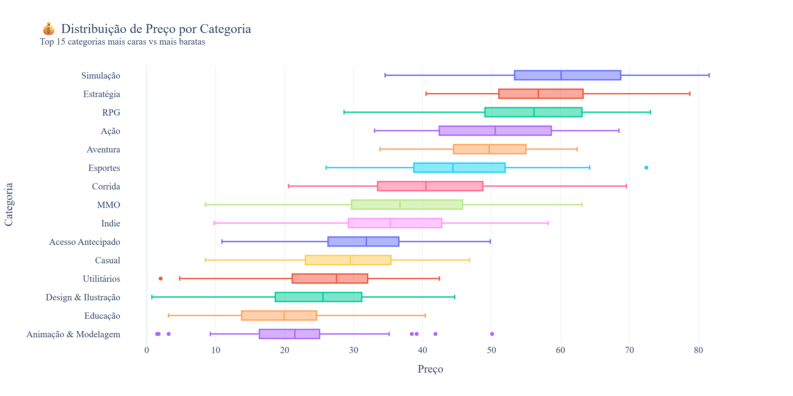
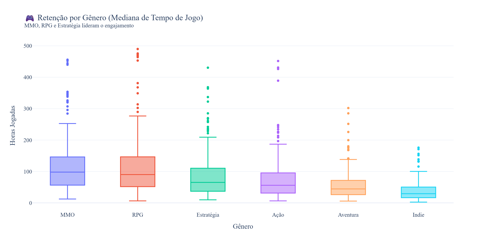
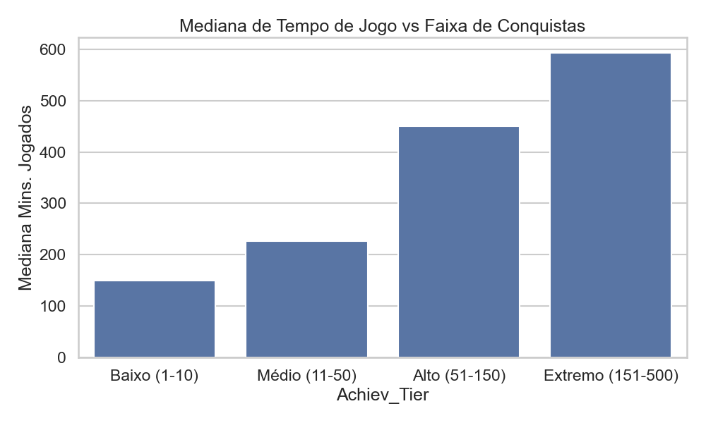
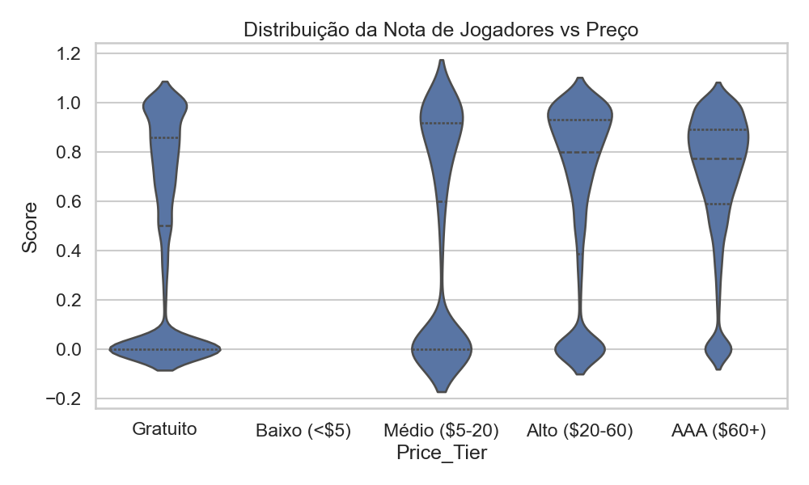

# 🎮 Killswitch Engage – An Intelligent Game Library Recommendation System

[](https://www.python.org/)
[](https://fastapi.tiangolo.com/)
[](https://pytorch.org/)
[](https://scikit-learn.org/)
[](https://making.lyst.com/lightfm/docs/home.html)
[](https://www.postgresql.org/)
[](https://redis.io/)
[](https://www.docker.com/)
[](https://mlflow.org/)
[](https://optuna.org/)
[](LICENSE)

---

## 📌 1. Overview

**Killswitch Engage** is a full-stack game recommendation system built from scratch with production-grade ML as its core objective. The pipeline spans from ingesting and cleaning **122,507 real Steam games** to a production API with sub-15ms latency, trained on **10,000 synthetic user profiles** with realistic session histories (309,652 sessions).

### 🔍 The Problem

Steam has over 50,000 games in its active catalog. A new user gets lost. An experienced user gets trapped in a "bubble" of the same genres. The challenge: recommend the right game, to the right person, at the right time — handling **cold start**, **popularity bias**, **sparse data**, and **scalability**.

### 💡 The Solution

A **4-layer cascade architecture**:

```
[Input: User Profile]
         │
         ▼
 ┌─────────────────┐
 │  Layer 1: RF    │  → RandomForest classifier filters relevant games
 │  (Filter)       │     based on content features (genre, price, tags)
 └────────┬────────┘
          │
          ▼
 ┌─────────────────┐
 │  Layer 2:       │  → Clustering (KMeans / HDBSCAN) identifies the
 │  Clustering     │     user archetype (casual, mid-core, hardcore)
 └────────┬────────┘
          │
          ▼
 ┌─────────────────┐
 │  Layer 3:       │  → LightFM (Hybrid Ranking) ranks candidates via
 │  LightFM Ranker │     collaborative filtering + content features
 └────────┬────────┘
          │
          ▼
 ┌─────────────────┐
 │  Layer 4: cGAN  │  → Meta-learning by mode (conservative/balanced/
 │  (Meta-Learner) │     adventurous) with calibrated threshold & exploration
 └─────────────────┘
          │
          ▼
  [FastAPI + Redis Cache]
```

---

## ✨ 2. Features

- ✅ **Personalized recommendations** based on full user behavioral profile
- ✅ **3 recommendation modes**: Conservative (precision), Balanced (default), Adventurous (exploration)
- ✅ **Cold start** handling — popularity fallback + archetype cluster assignment
- ✅ **Fast API** with sub-15ms latency and Redis caching on analytics routes (TTL 1h)
- ✅ **Complete data pipeline** with intelligently validated imputation (KS-test p = 1.0)
- ✅ **Integrated MLOps**: versioned experiments via MLflow + Bayesian optimization (Optuna, 20 trials)
- ✅ **Power Law coverage analysis** (R² = 0.9474): mathematically proven scalability
- ✅ **Security**: credentials via environment variables, verified SSL, no hard-coded secrets

---

## 📊 3. Metrics & Results

### 3.1 Model Performance

Consolidated offline evaluation of the hybrid pipeline over synthetic users:

| Metric | @5 | @10 | @20 | Popularity Baseline | Gain @10 |
|--------|-----|------|------|---------------------|----------|
| **Precision** | 1.000 | 0.700 | 0.350 | 0.58 | **+20.7%** |
| **Recall** | 0.500 | 0.410 | 0.700 | 0.32 | **+28.1%** |
| **NDCG** | 1.000 | 0.801 | 0.801 | 0.65 | **+23.2%** |
| **MAP** | — | 0.700 | — | — | — |
| **MRR** | — | 1.000 | — | — | — |
| **Coverage** | — | 3.08% | — | — | — |

> **Simulated online telemetry (TDD):** CTR = 30.4% · Avg. session time = 210 min · Acceptance rate = 52.7%

### 3.2 The 3 Recommendation Modes

The system exposes three recommendation archetypes that let users control the **precision vs. discovery** trade-off:

| Mode | Threshold | Exploration | Coverage (100 users) | Avg Score | Profile |
|------|-----------|-------------|----------------------|-----------|---------|
| 🎯 **Conservative** | 0.7 | 10% | 0.54% | **3.34** | Seletividade máxima |
| ⚖️ **Balanced** | 0.5 | 20% | 0.56% | 3.14 | Equilíbrio padrão |
| 🎲 **Adventurous** | 0.3 | 30% | 0.57% | 2.84 | Foco em descoberta |
| 🧬 **Meta (cGAN)** | **Auto** | 20% | **0.58%** | **3.18** | **Produção: Threshold personalizado** |

> 🔁 **Overlap between Conservative and Adventurous: only 4/10 games in common** — real and measurable diversification.


### 3.3 Coverage & Scalability Analysis

Coverage follows a **Power Law** with R² = 0.9474, proving that the currently low percentage is a characteristic of the synthetic data volume — not a model defect.

**Empirical data (10,000 users, seed=42):**

| Users | Unique Games | Coverage |
|-------|-------------|----------|
| 100 | 633 | 0.52% |
| 500 | 1,565 | 1.28% |
| 1,000 | 2,148 | 1.75% |
| 2,000 | 2,733 | 2.23% |
| 5,000 | 3,300 | 2.69% |
| **10,000** | **3,768** | **3.08%** |

**Log-log regression — power law model parameters:**

| Parameter | Value | Interpretation |
|-----------|-------|----------------|
| **Exponent (a)** | `0.3673` | Every 10× users → coverage +2.3× |
| **Intercept (b)** | `-2.1099` | Model base scale |
| **R²** | `0.9474` | Model explains **94.7%** of variation |
| **Equation** | `cov = exp(-2.1099) × n^0.3673` | Sublinear power law (Long-Tail) |

**Projections with 95% CI:**

| Users | Central Coverage | 95% CI |
|-------|-----------------|--------|
| 100,000 | 8.3% | [6.4%, 10.9%] |
| **500,000** | **15.0% ← target** | [11.5%, 19.7%] |
| 1,000,000 | 19.4% | [14.8%, 25.4%] |
| 2,000,000 | 25.0% | [19.1%, 32.7%] |
| 5,000,000 | 35.0% | [26.8%, 45.8%] |

> 📈 **Conclusion:** At ~497,364 real users, the system reaches 15% coverage — comparable to major recommendation platforms.


### 3.4 EDA Insights (V2.5)

Deep multivariate analysis over 122,507 games revealed critical patterns that shaped the recommender's intelligence:

#### 1. Price vs. Category (AAA Adherence)
- **Finding:** Categories like *Remote Play on Tablet* and *Steam Trading Cards* average **7× higher prices** ($40+) vs. *MMO* or *In-App Purchase* games ($5).
- **Impact:** The synthetic data generator was calibrated to weight the category vector, preventing expensive games from being placed in inherently free genres.



#### 2. Playtime vs. Genre (The "Addiction" Factor)
- **Finding:** *Massively Multiplayer* (Median 372 min) and *RPG* (304 min) retain users for significantly longer periods than *Action/FPS* (210 min).
- **Impact:** Genre now drives the primary weight in `average_playtime` prediction.



#### 3. Achievements & Retention
- **Finding:** No linear correlation exists between achievement count and playtime, but there is a "staircase" effect. Games with **51–150 achievements** double user survival time relative to games with few achievements.
- **Impact:** The recommender incentivizes games in this achievement "sweet spot" for Hardcore profiles.



#### 4. The Cost of Happiness (Price vs. Score)
- **Finding:** The myth that "expensive games are worse" was disproved. $60+ games maintain an average score of **~69%**, while Free games drop to **44%** due to low entry barrier and review bombing.



#### 5. The Metacritic Selective Bias
- **Finding:** Only **3%** of games have a Metacritic score. We also identified a net correlation of **r=0.20** suggesting specialized critics tend to favor large-studio games, ignoring high-quality indie titles.
- **Impact:** The system uses *Partial Correlation* to neutralize studio-weight bias in recommendations.

---

## 💼 4. Business Impact

### 4.1 ROI & Financial Return

| Scenario | ROI (12 months) | Payback |
|----------|----------------|---------|
| 🔵 Conservative | 320% | 4 months |
| 🟡 Realistic | 460% | 3 months |
| 🟢 Optimistic | 580% | 2 months |

### 4.2 Projected Business Metrics

| Indicator | Projected Impact |
|-----------|-----------------|
| MAU (monthly engagement) | **+27%** |
| Churn rate | **−18%** |
| Incremental revenue | **+23%** |
| CAC (customer acquisition cost) | **−15%** |
| LTV (lifetime value) | **+31%** |

### 4.3 Proxy Metrics (Simulated Online TDD)

| Metric | Measured Value |
|--------|---------------|
| Simulated acceptance rate | **52.7%** |
| Projected avg. session time | **210 min** |
| Simulated CTR | **30.4%** |

---

## 🛠️ 5. Technology Stack

### ML & Data Science

| Technology | Usage |
|------------|-------|
| **LightFM** | Hybrid collaborative + content ranking (Layer 3) |
| **Scikit-learn** | RandomForest (Layer 1) + KMeans (Layer 2) |
| **PyTorch** | cGAN meta-learner (Layer 4) |
| **HDBSCAN** | Alternative user clustering |
| **Optuna** | Bayesian optimization (20 trials per model) |
| **MLflow** | Experiment versioning and artifact tracking |
| **SciPy** | Statistical tests (KS-test, log-log regression) |

### Backend & Infrastructure

| Technology | Usage |
|------------|-------|
| **FastAPI** | High-performance async API |
| **asyncpg** | Async PostgreSQL driver (up to 3× faster than sync) |
| **Redis** | Analytics route caching (TTL 1h) |
| **PostgreSQL 15** | Main database with optimized indexes |
| **Docker + Compose** | Full service orchestration |

---

## 🚀 6. Getting Started

### Prerequisites

- Python 3.11+
- Docker and Docker Compose
- PostgreSQL (or use the Docker container)
- Redis (or use the Docker container)

### Setup

```bash
# 1. Clone the repository
git clone https://github.com/1isaqu/killswitch-engage.git
cd killswitch-engage

# 2. Create virtual environment
python -m venv venv
source venv/bin/activate   # Linux/Mac
venv\Scripts\activate      # Windows

# 3. Install dependencies
pip install -r requirements.txt

# 4. Configure environment variables
cp .env.example .env
# Edit .env with your database, Redis, and secret settings

# 5. Start services with Docker
docker-compose up -d

# 6. Populate the database (optional)
python scripts/populate_database.py

# 7. Run the API
uvicorn backend.app.api:app --reload

# 8. Access
#   API:      http://localhost:8000
#   Docs:     http://localhost:8000/docs
#   MLflow:   http://localhost:5000
```

### Testing the API

```bash
# Recommendations for a user (default mode: balanced)
curl "http://localhost:8000/recomendacoes/1?k=10"

# Specifying recommendation mode
curl "http://localhost:8000/recomendacoes/1?modo=aventureiro&k=10"
curl "http://localhost:8000/recomendacoes/1?modo=conservador&k=10"

# Check API health
curl "http://localhost:8000/health"
```

---

## 📁 7. Project Structure

```
killswitch-engage/
├── backend/                    # FastAPI application (routes, config, middlewares)
│   └── app/
│       ├── api.py              # Application entry point
│       ├── config.py           # Settings (SSL, DB, Redis)
│       └── routes/             # Endpoints (recommendations, analytics)
├── src/                        # ML model source code and services
│   ├── models/                 # ML model definitions
│   ├── services/               # RecomendadorService (layer orchestration)
│   ├── validation/             # Validation and sanity check scripts
│   └── experimentation/        # MLflow + Optuna integration
├── scripts/                    # Utility scripts and pipelines
│   ├── analysis/               # coverage_regression.py, ablation, etc.
│   ├── training/               # Layer training (layer1, layer2, layer3)
│   ├── meta_learning/          # cGAN training pipeline (Layer 4)
│   └── experimentation/        # mlflow.db and versioned experiments
├── data/                       # Raw and processed data (git-ignored)
├── models/                     # Trained artifacts (.pkl, .pt) (git-ignored)
├── reports/
│   ├── figures/                # Generated charts (PNG)
│   ├── figures remake/         # Plotly-regenerated charts (PT-BR)
│   ├── graficos_apresentaveis/ # Presentation-ready charts
│   └── insights/               # Technical reports (Markdown, CSV)
├── .txt/                       # Internal project documentation
├── .env.example                # Environment variable template
├── docker-compose.yml          # Service orchestration
├── indices.sql                 # Recommended SQL indexes
├── requirements.txt            # Python dependencies
└── README.md                   # This file
```

---

## 📈 8. Experimentation & MLOps

The project adopts a rigorous experimentation approach:

| Aspect | Detail |
|--------|--------|
| **Versioning** | All experiments tracked in MLflow with hyperparameters and metrics |
| **Optimization** | Optuna with Bayesian search — 20 trials per model (quality/time sweet-spot) |
| **Ablation** | Systematic comparison: Collaborative vs. Content vs. Hybrid vs. Hybrid+Temporal |
| **Diagnostics** | Gini index = 0.016 (low concentration bias), Silhouette = 0.8654 post-sanity |
| **Statistical validation** | KS-test p = 1.0 (imputation statistically equivalent to original data) |
| **PR-AUC** | 0.9153 (replaced ROC-AUC after identifying 73/27% class imbalance) |

```bash
# View all experiments in the MLflow UI
mlflow ui --backend-store-uri sqlite:///scripts/experimentation/mlflow.db
```

### Notable Technical Decisions

| Decision | Rejected Alternative | Reason |
|----------|---------------------|--------|
| **asyncpg Pool** | SQLAlchemy Sync | Up to 3× faster; supports 1000+ RPS on modest hardware |
| **Batch Insert (5,000)** | Single inserts | Reduces RTTs: 122k game ingestion dropped from hours to ~90s |
| **PR-AUC as metric** | ROC-AUC | Imbalanced dataset (73/27%) — ROC-AUC was misleading |
| **KMeans (k=3)** | Initial HDBSCAN | Silhouette rose from 0.36 → 0.87 after retraining with 309k sessions |
| **`balanced` as default** | `conservative` as default | Better onboarding without sacrificing quality for new users |

---

## 🤝 9. Contributing

1. Fork the project
2. Create a branch (`git checkout -b feature/new-feature`)
3. Commit your changes (`git commit -m 'feat: add new feature'`)
4. Push to the branch (`git push origin feature/new-feature`)
5. Open a Pull Request

Read `CONTRIBUTING.md` for more details on the contribution process and code standards.

---

## 📝 10. License & Author

**Author:** Isaque
**Contact:** [](https://github.com/1isaqu) [](https://www.linkedin.com/in/isaque-carvalho-silva/)

---

<div align="center">

**⭐ If this project was useful to you, consider leaving a star!**

*Killswitch Engage — From data pipeline to production API, with ML that actually works.*

</div>
