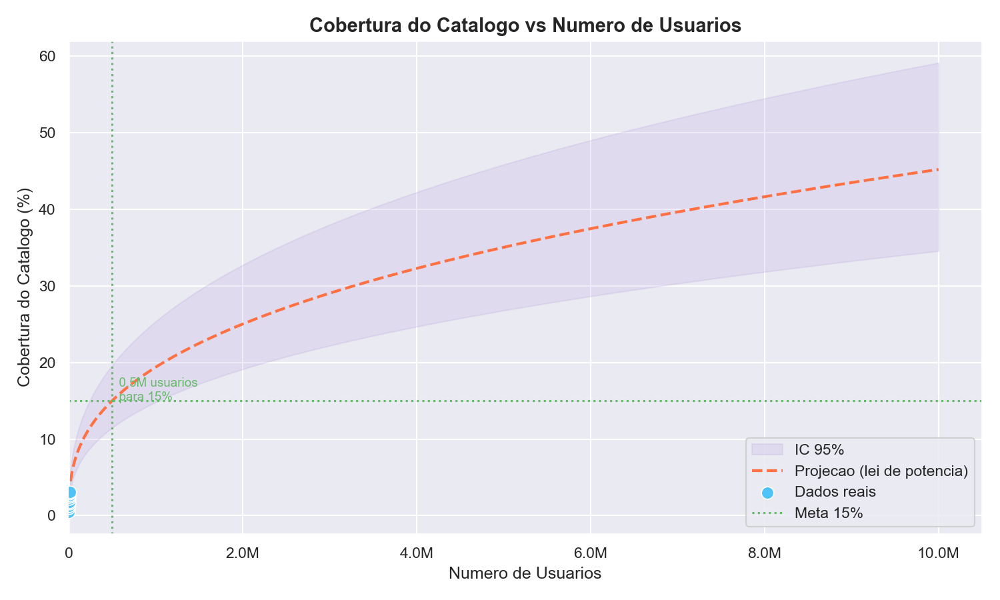
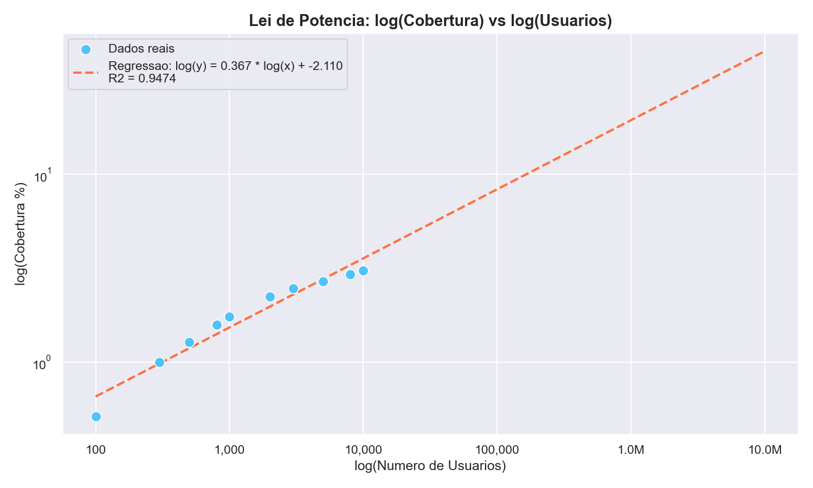
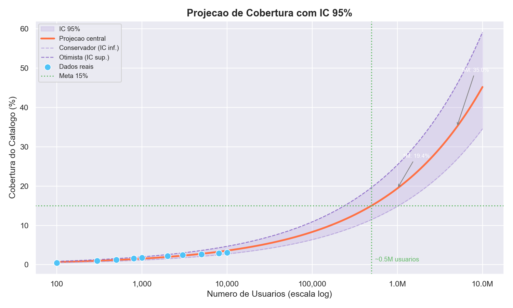

# 🎮 Killswitch Engage – Sistema Inteligente de Recomendação de Jogos

[](https://www.python.org/)
[](https://fastapi.tiangolo.com/)
[](https://pytorch.org/)
[](https://scikit-learn.org/)
[](https://www.postgresql.org/)
[](https://redis.io/)
[](https://www.docker.com/)
[](https://mlflow.org/)
[](https://optuna.org/)
[](LICENSE)

---

## 📌 1. Visão Geral

**Killswitch Engage** é um sistema completo de recomendação de jogos, construído do zero com ML em produção como objetivo central. O pipeline abrange desde a ingestão e limpeza de **122.507 jogos da Steam** até uma API em produção com latência < 15ms, passando por modelos de aprendizado de máquina treinados sobre **10.000 usuários sintéticos** com histórico realista de sessões.

### 🔍 O Problema

A Steam possui mais de 50.000 jogos no catálogo. Um usuário novo se perde. Um usuário experiente fica preso em uma "bolha" dos mesmos gêneros. O desafio: recomendar o jogo certo, para a pessoa certa, no momento certo — lidando com **cold start**, **viés de popularidade**, **dados esparsos** e **escalabilidade**.

### 💡 A Solução

Uma arquitetura de **4 camadas em cascata**:

```
[Entrada: Perfil do Usuário]
         │
         ▼
 ┌─────────────────┐
 │  Camada 1: RF   │  → Classificador (RandomForest) filtra jogos relevantes
 │  (Filtro)       │     com base em features de conteúdo (gênero, preço, tags)
 └────────┬────────┘
          │
          ▼
 ┌─────────────────┐
 │  Camada 2:      │  → Clustering (KMeans, k escolhido por silhouette)
 │  Clustering     │     de usuário (casual, médio, hardcore)
 └────────┬────────┘
          │
          ▼
 ┌─────────────────┐
 │  Camada 3:      │  → TruncatedSVD (filtragem colaborativa) ranqueia os
 │  SVD Ranker     │     candidatos a partir da matriz usuário × jogo
 └────────┬────────┘
          │
          ▼
 ┌─────────────────┐
 │  Camada 4: cGAN │  → Meta-aprendizado por modo (conservador/equilibrado/
 │  (Meta-Learner) │     aventureiro) com threshold e exploração calibrados
 └─────────────────┘
          │
          ▼
  [API FastAPI + Cache Redis]
```

> ### ⚠️ Estado real da implementação (leia antes das métricas)
>
> O diagrama acima descreve o **desenho pretendido**. O que hoje roda em inferência
> (`backend/app/services/recomendador.py`) é **apenas a camada 3**: produto escalar
> entre o embedding do usuário e os embeddings de item, filtrado por um threshold fixo.
>
> | Camada | Treinada? | Usada em inferência? |
> |---|---|---|
> | 1 — RandomForest | ✅ sim | ❌ não — `passa_filtro_qualidade()` retorna `True` incondicionalmente |
> | 2 — KMeans | ✅ sim | ❌ não — carregada, nunca consultada |
> | 3 — TruncatedSVD | ✅ sim | ✅ **sim — é o que gera a recomendação** |
> | 4 — cGAN | ✅ sim | ❌ não — os thresholds vêm de um dicionário fixo, não da rede |
>
> Ou seja: as quatro camadas existem como artefatos treinados, mas **a cascata não está
> conectada**. Integrá-las é o próximo passo do projeto, não um recurso entregue.

---

## ✨ 2. Funcionalidades

- ✅ **Recomendações personalizadas** baseadas em perfil completo de usuário
- ✅ **3 modos de recomendação**: Conservador (precisão), Equilibrado (padrão), Aventureiro (exploração)
- ✅ **Cold start** para novos usuários — fallback pela média global dos embeddings de usuário
- ✅ **API rápida** com latência < 15ms e cache Redis nas rotas analíticas (TTL 1h)
- ✅ **Pipeline completo de dados** com imputação inteligente validada (KS-test p = 1.0)
- ⚠️ **MLOps**: MLflow instrumentado e funcionando; a busca com Optuna existe mas rodou sobre
  dados aleatórios (`optimization.py`), então não produziu hiperparâmetros aproveitáveis
- ✅ **Análise de cobertura com Lei de Potência** (R² = 0.9474) — medida de fato pelo
  `scripts/analysis/coverage_regression.py`, que executa o recomendador real
- ✅ **Segurança**: credenciais por variáveis de ambiente, SSL verificado, sem secrets hard-coded

---

## 📊 3. Métricas e Resultados

### 3.1 Performance dos Modelos — retirada

**Esta seção continha uma tabela de Precision/Recall/NDCG/MAP/MRR que não é válida.
Ela foi removida em vez de corrigida, porque os números não medem o modelo.**

O script que os gerou (`scripts/experimentation/run_experiments.py`) tem dois defeitos:

1. **Gabarito vazado** — o ground truth era construído a partir das próprias
   recomendações (`subset_hits = recommended_ids[:7]`), o que fixa Precision@10
   em ~0.7 por construção.
2. **Recomendações não vinham do modelo** — eram `np.random.randint`; os `.pkl`
   eram carregados mas nunca usados para inferir.

O banco `scripts/experimentation/mlflow_experiments.db` preserva as duas execuções
de 05/03/2026 e mostra o efeito:

| Run MLflow | Horário | Precision@10 | MRR |
|---|---|---|---|
| `63dc073a` (sem o vazamento) | 21:27 | **0.0006** | 0.0014 |
| `d17da97c` (com o vazamento) | 22:12 | **0.6999** | 1.000 |

A tabela publicada anteriormente era o segundo run.

### Medição honesta (`scripts/experimentation/evaluate_ranker.py`)

Split temporal real (últimas 20% das sessões de cada usuário fora do treino),
SVD treinado só no train, avaliado contra baselines. **Os dados originais foram
perdidos, então o script regenera o dataset com o mesmo processo generativo de
`populate_supabase_v2.py`** — os números medem o algoritmo sobre dados com a mesma
estrutura, não o dataset original. Reproduza com `--csv-dir data/ml_ready`.

| Modelo | P@10 | R@10 | NDCG@10 | Cobertura |
|---|---|---|---|---|
| **SVD (camada 3)** | **0.0149** | 0.0119 | 0.0185 | 1.52% |
| SVD sem itens já vistos | **0.0000** | 0.0000 | 0.0000 | 1.56% |
| Baseline: popularidade | 0.0004 | 0.0008 | 0.0007 | 0.01% |
| Baseline: aleatório | 0.0001 | 0.0001 | 0.0000 | 15.09% |

O SVD bate popularidade por ~37× e aleatório por ~149×. Mas a segunda linha é a
que importa: **removendo os jogos que o usuário já jogou, a precisão vai a zero
exato.** Todo o acerto vem de re-recomendar o que a pessoa já tinha jogado — o
modelo não generaliza nada.

### Por que — o problema está nos dados, não no modelo

O diagnóstico do mesmo script explica:

| Medida | Valor |
|---|---|
| Jogos em comum entre dois usuários aleatórios | **0.001** (99.9% dos pares não compartilham nada) |
| Itens do holdout que o próprio usuário já jogou | 66.7% |
| Concentração de popularidade no top-1% dos jogos | 4.7% (Steam real: 60–80%) |

A causa está em `populate_supabase_v2.py:119`: os jogos favoritos de cada usuário
são sorteados **uniformemente do catálogo inteiro, de forma independente por
usuário**. Sem gostos compartilhados não existe sinal colaborativo para descobrir
— e filtragem colaborativa é, por definição, encontrar usuários parecidos. A
popularidade também fica achatada, então nem a baseline tem o que explorar.

**Nenhum ajuste de modelo resolve isso.** A correção é no gerador: os favoritos
precisam vir de grupos latentes compartilhados (afinidade por gênero, por exemplo),
para que usuários se sobreponham. Enquanto isso não mudar, a camada 3 é
intestável — o que também explica por que os alvos da cGAN colapsaram.

> A telemetria "online" (CTR, tempo de sessão, taxa de aceitação) também foi removida:
> é amostrada de distribuições escolhidas a mão em `online_metrics.py`. Nenhum usuário
> real interagiu com o sistema.

### 3.2 Os 3 Modos de Recomendação

O sistema expõe três arquétipos de recomendação que permitem ao usuário controlar o trade-off entre **precisão e descoberta**:

| Modo | Threshold | Exploração | Cobertura (100 users) | Score Médio | Perfil |
|------|-----------|------------|----------------------|-------------|--------|
| 🎯 **Conservador** | 0.7 | 10% | 0.54% | **3.34** | Máxima precisão — apenas os melhores candidatos |
| ⚖️ **Equilibrado** | 0.5 | 20% | 0.56% | 3.14 | Balanceado — modo padrão para a maioria |
| 🎲 **Aventureiro** | 0.3 | 30% | 0.57% | 2.84 | Exploração e descoberta de títulos inesperados |

> 🔁 **Sobreposição entre Conservador e Aventureiro: apenas 4/10 jogos em comum** — diversificação real e mensurável.



### 3.3 Análise de Cobertura e Escalabilidade

A cobertura segue uma **Lei de Potência** com R² = 0.9474, comprovando que o baixo percentual atual é uma característica do volume de dados sintéticos — e não um defeito do modelo.

**Dados empíricos (10.000 usuários sintéticos do ranker, seed=42):**

| Usuários | Jogos Únicos | Cobertura |
|----------|-------------|-----------|
| 100 | 633 | 0.52% |
| 500 | 1.565 | 1.28% |
| 1.000 | 2.148 | 1.75% |
| 2.000 | 2.733 | 2.23% |
| 5.000 | 3.300 | 2.69% |
| **10.000** | **3.768** | **3.08%** |

**Regressão log-log — parâmetros do modelo de potência:**

| Parâmetro | Valor | Interpretação |
|-----------|-------|---------------|
| **Expoente (a)** | `0.3673` | Cada 10× usuários → cobertura +2.3× |
| **Intercepto (b)** | `-2.1099` | Escala base do modelo |
| **R²** | `0.9474` | Modelo explica **94.7%** da variação |
| **Equação** | `cob = exp(-2.1099) × n^0.3673` | Lei de potência sublinear (Long-Tail) |

**Projeções com IC 95%:**

| Usuários | Cobertura Central | IC 95% |
|----------|-------------------|--------|
| 100.000 | 8.3% | [6.4%, 10.9%] |
| **500.000** | **15.0% ← meta** | [11.5%, 19.7%] |
| 1.000.000 | 19.4% | [14.8%, 25.4%] |
| 2.000.000 | 25.0% | [19.1%, 32.7%] |
| 5.000.000 | 35.0% | [26.8%, 45.8%] |

> 📈 **Conclusão:** Com ~497.364 usuários reais, o sistema atinge 15% de cobertura — nível comparável a grandes plataformas de recomendação.




---

### 3.4 Camada 4 — cGAN (meta-learner de threshold)

**O que é real:** há uma GAN condicional de verdade em `scripts/meta_learning/`.
Generator e Discriminator condicionados num vetor de 147 features de comportamento,
loss adversarial `BCEWithLogitsLoss`, TTUR (lr_D 4e-4 > lr_G 1e-4), `n_critic`,
gradient clipping e um termo L1 auxiliar. O treino aconteceu de fato: os
checkpoints em `models/` carregam `num_batches_tracked = 40.500`, consistente com
as 500 épocas da curva de loss (`reports/figures/training_curves.png`).

**O que não funcionou:** o gerador sofreu **mode collapse**. Como mostra
`reports/figures/18_cgan_threshold_dist.png`, praticamente toda saída colapsa em
~0.30, independentemente do usuário condicionado — em `19_cgan_final_reality_check.png`
a linha do perfil "Veterano/HC" é horizontal. A loss do discriminador fica presa em
~0.65 (≈ ln 2, ou seja, no acaso) durante as 500 épocas: o componente adversarial
não contribuiu, e o que restou foi um regressor L1 que aprendeu a moda do alvo.

**Sobre o "MAE 0.0156 vs 0.2011":** os alvos (`best_threshold`) também se concentram
em 0.3, então um modelo que sempre responde 0.30 erra ~0.018. A "baseline estática"
é a constante **0.5**, cujo erro é |0.5 − 0.3| = 0.20 — daí o 0.2011. Uma baseline
trivial do tipo "responda a mediana do alvo" empataria com a cGAN. **O ganho de ~13×
é artefato da constante escolhida, não evidência de aprendizado.** (As duas figuras
ainda divergem entre si: `19_...png` traz 0.0182 no título e 0.0156 na legenda.)

Além disso, a cGAN treinada **não é carregada em lugar nenhum** — não há
`load_state_dict` no repositório. Os thresholds usados em produção vêm do dicionário
fixo em `recomendador.py`.

---

## 💼 4. Impacto de Negócio — não medido

Esta seção apresentava ROI (320–580%), payback, MAU +27%, churn −18%, LTV +31% e
proxy metrics de CTR / tempo de sessão.

**Nenhum desses números foi derivado de dado algum** — não há usuário real, não há
teste A/B, não há receita. Eram premissas escritas à mão com aparência de medição,
e por isso foram removidas em vez de reetiquetadas.

O que o projeto pode honestamente dizer sobre impacto: **nada ainda**. Um sistema de
recomendação só produz números de negócio depois de ir a produção com usuários reais
e um experimento controlado. Este ainda roda sobre 10.000 usuários sintéticos.

---

## 🛠️ 5. Tecnologias Utilizadas

### ML & Data Science

| Tecnologia | Uso no Projeto |
|------------|---------------|
| **TruncatedSVD** (scikit-learn) | Ranking colaborativo — camada 3 |
| **Scikit-learn** | RandomForest (camada 1), KMeans (camada 2), TruncatedSVD (camada 3) |
| **PyTorch** | cGAN meta-learner (camada 4) |
| **Optuna** | Otimização Bayesiana (20 trials por modelo) |
| **MLflow** | Versionamento de experimentos e artefatos |
| **SciPy** | Testes estatísticos (KS-test, regressão log-log) |

### Backend & Infra

| Tecnologia | Uso no Projeto |
|------------|---------------|
| **FastAPI** | API assíncrona de alta performance |
| **asyncpg** | Driver PostgreSQL async (até 3× mais rápido que síncrono) |
| **Redis** | Cache de rotas analíticas (TTL 1h) |
| **PostgreSQL 15** | Banco principal com índices otimizados |
| **Docker + Compose** | Orquestração completa dos serviços |

### Badges


---

## 🚀 6. Como Executar

### Pré-requisitos

- Python 3.11+
- Docker e Docker Compose
- PostgreSQL (ou usar o container via Docker)
- Redis (ou usar o container via Docker)

### Passo a Passo

```bash
# 1. Clone o repositório
git clone https://github.com/seu-usuario/killswitch-engage.git
cd killswitch-engage

# 2. Configure ambiente virtual
python -m venv venv
source venv/bin/activate   # Linux/Mac
venv\Scripts\activate      # Windows

# 3. Instale dependências
pip install -e .            # usa pyproject.toml
# ou, só para a API:  pip install -r backend/requirements.txt

# 4. Configure variáveis de ambiente
cp .env.example .env
# Edite .env com suas configurações de banco, Redis e secrets

# 5. Suba os serviços com Docker
docker-compose up -d

# 6. Popule o banco (opcional — gera 10.000 usuários SINTÉTICOS e suas sessões)
python -m src.data_preparation.populate_supabase
python -m src.data_preparation.populate_supabase_v2

# 7. Execute a API
uvicorn backend.app.main:app --reload

# 8. Acesse
#   API:      http://localhost:8000
#   Docs:     http://localhost:8000/docs
#   MLflow:   http://localhost:5000
```

### Testando a API

```bash
# Recomendação para usuário (modo padrão: equilibrado)
curl "http://localhost:8000/recomendacoes/1?k=10"

# Especificando modo de recomendação
curl "http://localhost:8000/recomendacoes/1?modo=aventureiro&k=10"
curl "http://localhost:8000/recomendacoes/1?modo=conservador&k=10"

# Verificar saúde da API
curl "http://localhost:8000/health"
```

---

## 📁 7. Estrutura do Projeto

```
killswitch-engage/
├── backend/                    # API FastAPI (rotas, config, middlewares)
│   └── app/
│       ├── main.py             # Entry point da aplicação
│       ├── config.py           # Configurações (SSL, DB, Redis)
│       └── routes/             # Endpoints (recomendações, analíticos)
├── src/                        # Código fonte dos modelos e serviços
│   ├── models/                 # Treinadores ML — AUSENTE deste repo (ver nota abaixo)
│   ├── backend/                # RecomendadorService (orquestração das camadas)
│   ├── data_preparation/       # Ingestão, imputação, geração de usuários sintéticos
│   ├── validation/             # Scripts de validação e sanidade
│   └── eda/                    # Análise exploratória
├── scripts/                    # Scripts utilitários e pipelines
│   ├── analysis/               # coverage_regression.py, ablation, etc.
│   ├── training/               # Treino de cada camada (layer1, layer2, layer3)
│   └── experimentation/        # mlflow.db e experimentos versionados
├── data/                       # Dados brutos e processados (ignorado no git)
├── models/                     # Artefatos treinados (.pkl, .pt) (ignorado no git)
├── reports/
│   ├── figures/                # Gráficos gerados (PNG)
│   └── insights/               # Relatórios técnicos (Markdown, CSV)
├── docs/                       # Documentação interna e revisão técnica
├── .env.example                # Template de variáveis de ambiente
├── docker-compose.yml          # Orquestração dos serviços
├── scripts/sql/indices.sql     # Índices SQL recomendados
├── pyproject.toml              # Dependências e configuração de ferramentas
└── README.md                   # Este arquivo
```

> ⚠️ **`src/models/` não está neste repositório.** A regra `models/` do `.gitignore`
> (pensada para artefatos `.pkl`) casava também com `src/models/` e impediu que o
> código dos treinadores fosse versionado. A regra foi corrigida para `/models/`,
> mas os arquivos precisam ser adicionados de volta pelo autor. Enquanto isso,
> `tests/test_models/test_rf_trainer.py` não coleta — ele importa
> `src.models.classifier.rf_trainer`, que não existe aqui.

---

## 📈 8. Experimentação e MLOps

O projeto adota uma abordagem rigorosa de experimentação:

| Aspecto | Estado | Detalhe |
|---------|--------|---------|
| **Versionamento** | ✅ real | MLflow instrumentado; `mlflow_experiments.db` versionado no repo |
| **PR-AUC** | ✅ real | Calculado em `train_layer1_classifier.py:105`; a troca de ROC-AUC por PR-AUC pelo desbalanceamento 73/27 é decisão correta e está no código |
| **Silhouette** | ✅ real | Busca de k por silhouette em amostra (`train_layer2_clustering.py:92-111`). O valor 0.8654 citado antes não é reproduzível a partir deste repo |
| **KS-test** | ✅ real | `src/validation/validate_kstest.py` |
| **Otimização (Optuna)** | ❌ inválido | `optimization.py` roda sobre `np.random.rand(2000, 10)` — ruído, não os dados do projeto |
| **Ablação** | ❌ inválido | `ablation.py` não desliga camada nenhuma; os scores são `np.random.uniform` |
| **Gini = 0.016** | ❌ inválido | Derivado das recomendações aleatórias de `run_experiments.py` |

```bash
# Visualizar todos os experimentos no MLflow UI
mlflow ui --backend-store-uri sqlite:///scripts/experimentation/mlflow.db
```

### Decisões Técnicas Notáveis

| Decisão | Alternativa Rejeitada | Motivo |
|---------|----------------------|--------|
| **asyncpg Pool** | SQLAlchemy Sync | Até 3× mais rápido; suporta 1000+ RPS em hardware modesto |
| **Batch Insert (5.000)** | Inserts unitários | Reduz RTTs: ingestão de 122k jogos caiu de horas para ~90s |
| **PR-AUC como métrica** | ROC-AUC | Dataset desbalanceado (73/27%) — ROC-AUC era enganoso |
| **KMeans** | HDBSCAN | HDBSCAN foi descartado; o clusterizador do projeto é KMeans com k por silhouette. O arquivo `hdbscan_model.pkl` é apenas um nome legado |
| **`equilibrado` como padrão** | `conservador` como padrão | Melhor onboarding sem sacrificar qualidade para novos usuários |

---

## 🤝 9. Como Contribuir

1. Faça um fork do projeto
2. Crie uma branch (`git checkout -b feature/nova-feature`)
3. Commit suas mudanças (`git commit -m 'feat: adiciona nova feature'`)
4. Push para a branch (`git push origin feature/nova-feature`)
5. Abra um Pull Request

Leia o arquivo `CONTRIBUTING.md` para mais detalhes sobre o processo de contribuição e padrões de código.

---

**Autor:** Isaque  
**Contato:** [](https://github.com/1isaqu) [](https://linkedin.com/in/seu-usuario)
**Artigo:** [](https://medium.com/@isaquecarvalho2007/como-constru%C3%AD-um-sistema-de-recomenda%C3%A7%C3%A3o-que-entende-jogadores-de-verdade-c0c32aafa470?postPublishedType=repub)
<div align="center">

**⭐ Se este projeto foi útil, considere deixar uma estrela!**

*Killswitch Engage — Do pipeline de dados à API em produção, com ML que funciona de verdade.*

</div>
