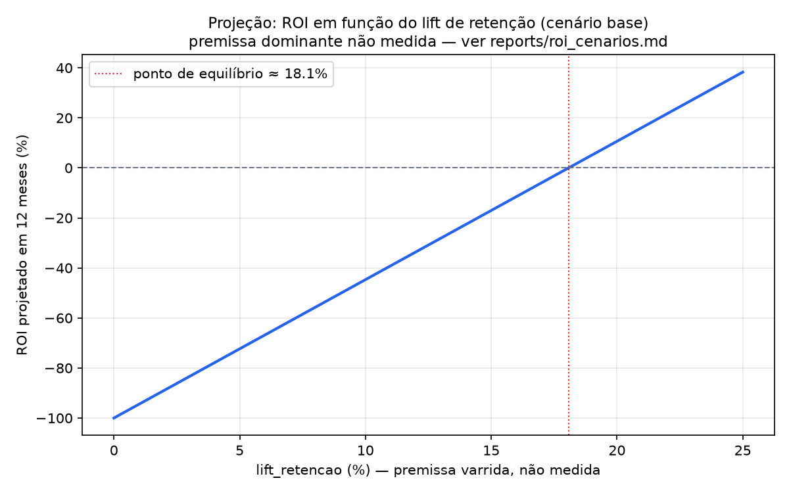
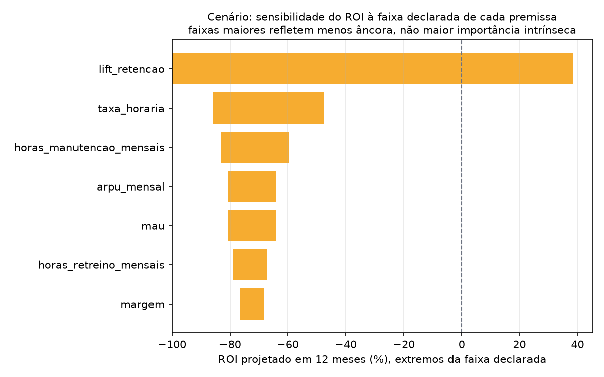
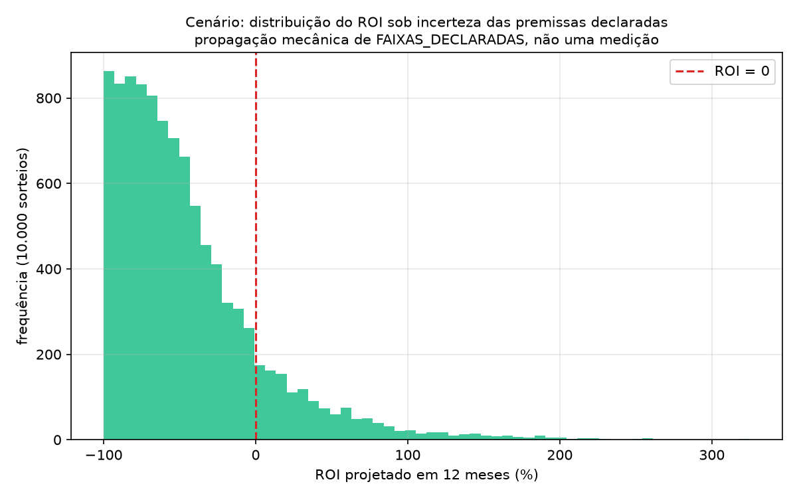

# ROI do recomendador — projeções sob premissas explícitas

> ⚠️ **Nada nesta página é medição.** O sistema nunca foi a produção — não há receita real, não há grupo de controle, não há usuário real. Todo número aqui é função de premissas declaradas explicitamente (ver `PARAMETROS_BASE` e `FAIXAS_DECLARADAS` em `scripts/experimentation/roi_sensitivity.py`), e cada tabela/figura diz "projeção" ou "cenário" no título — nunca "resultado" ou "medição". Para o que falta instrumentar para medir de verdade, ver [`reports/plano_medicao_negocio.md`](plano_medicao_negocio.md).


Gerado por `scripts/experimentation/roi_sensitivity.py --seed 42 --horizonte-meses 12`. Reproduzível: mesmo comando, mesmo resultado.

## Modelo

```
receita_incremental = MAU × lift_retencao × ARPU × margem
custo_operacao_mensal = custo_infra
                         + (horas_manutencao + horas_retreino) × taxa_horaria
ROI(horizonte) = (receita_incremental × horizonte − custo_operacao_mensal × horizonte)
                  / (custo_operacao_mensal × horizonte)
```
Custo de desenvolvimento inicial (setup) é tratado como afundado e fica fora — a pergunta que este ROI responde é se vale a pena **continuar operando**, não se valeu a pena construir.

**Lado de custo — ancorado em preço público, fonte e data de consulta no topo do script.** Lado de benefício — `MAU` e `margem` são parâmetros de cenário sem medição; `ARPU` tem uma referência de mercado citada (jogos casuais mobile, US$0,50-2,00/mês); `lift_retencao` não tem nenhuma âncora — é a premissa dominante.

## 1. Curva de ROI por lift_retencao (cenário, não resultado)

Cenário base: MAU=10,000 · ARPU=US$1.00/mês · margem=70% · lift_retencao=5.0% · manutenção=8h/mês · retreino=4h/mês · taxa=US$100/h, horizonte = 12 meses. `lift_retencao` varrido de 0% a 25% — acima do exemplo de 0-15% da tarefa original, estendido só para que o ponto de equilíbrio (abaixo) apareça dentro do gráfico.

| lift_retencao | ROI projetado (12 meses) |
|---:|---:|
| 0% | -100.0% |
| 2% | -88.9% |
| 4% | -77.9% |
| 6% | -66.8% |
| 8% | -55.7% |
| 10% | -44.7% |
| 12% | -33.6% |
| 14% | -22.6% |
| 16% | -11.5% |
| 18% | -0.4%  ← equilíbrio |
| 20% | +10.6% |
| 22% | +21.7% |
| 24% | +32.8% |

**Ponto de equilíbrio: lift_retencao ≥ 18.1%** para ROI positivo em 12 meses, no cenário base. É o número mais útil desta página: uma afirmação verificável — "o sistema se paga se, e somente se, melhorar retenção em pelo menos 18.1%" — contra parâmetros de custo e benefício que qualquer leitor pode contestar e recalcular.



## 2. Elasticidade pontual (cenário base)

Variação percentual do ROI para +1% em cada parâmetro, no cenário base, mantendo os demais fixos:

| Parâmetro | Elasticidade do ROI |
|---|---:|
| lift_retencao | -0.38 |
| arpu_mensal | -0.38 |
| margem | -0.38 |
| mau | -0.38 |
| taxa_horaria | +0.36 |
| horas_manutencao_mensais | +0.24 |
| horas_retreino_mensais | +0.12 |

**As quatro elasticidades do lado da receita (`mau`, `arpu_mensal`, `margem`, `lift_retencao`) saem empatadas.** Isso é uma propriedade da fórmula — ela é multiplicativa nos quatro termos, então 1% em qualquer um produz o mesmo efeito relativo na receita. **Elasticidade pontual não é o que sustenta a afirmação de que `lift_retencao` domina** — quem sustenta isso é a análise de faixa a seguir, porque a incerteza sobre cada premissa não é a mesma.

## 3. Sensibilidade por faixa declarada (cenário, tornado)

Para cada parâmetro, ROI nos dois extremos da faixa plausível declarada (`FAIXAS_DECLARADAS` no script), mantendo os demais no cenário base:

| Parâmetro | ROI no mínimo da faixa | ROI no máximo da faixa | Amplitude |
|---|---:|---:|---:|
| lift_retencao | -100.0% | +38.3% | 138 p.p. |
| taxa_horaria | -85.8% | -47.4% | 38 p.p. |
| horas_manutencao_mensais | -83.1% | -59.6% | 23 p.p. |
| arpu_mensal | -80.6% | -64.0% | 17 p.p. |
| mau | -80.6% | -64.0% | 17 p.p. |
| horas_retreino_mensais | -79.0% | -67.1% | 12 p.p. |
| margem | -76.5% | -68.2% | 8 p.p. |

**`lift_retencao` domina — uma variação de 0% a 25% nessa premissa move o ROI em 138 pontos percentuais**, mais que qualquer outro parâmetro. Parte da amplitude reflete a faixa em si ter sido declarada mais larga — mas essa é exatamente a questão: a faixa de `lift_retencao` é a mais larga porque é a única sem nenhuma fonte, interna ou externa, ancorando sequer a ordem de grandeza. As demais faixas, mesmo sendo também premissas, vêm de meta de produto ou de benchmark de mercado citado.



## 4. Três cenários (conservador / base / otimista)

| Premissa | Conservador | Base | Otimista |
|---|---:|---:|---:|
| `mau` | 7,000 | 10,000 | 15,000 |
| `arpu_mensal` | US$0.70 | US$1.00 | US$1.50 |
| `margem` | 60% | 70% | 75% |
| `lift_retencao` | 1% | 5% | 15% |
| `horas_manutencao_mensais` | 12h | 8h | 6h |
| `horas_retreino_mensais` | 6h | 4h | 3h |
| `taxa_horaria` | US$120/h | US$100/h | US$90/h |
| **ROI projetado (12 meses)** | **-98.7%** | **-72.3%** | **+189.1%** |

Título desta tabela é "cenário", não "resultado": os três pontos são combinações de premissas escolhidas para ilustrar o intervalo, não uma previsão central com dois desvios.

## 5. Incerteza propagada (Monte Carlo sobre as faixas declaradas)

10.000 sorteios uniformes dentro de `FAIXAS_DECLARADAS`, seed=42. Mediana do ROI projetado: **-57.0%**. P(ROI > 0) sob estas faixas: **13.8%**. Percentis 10/90: [-91.7%, +15.7%].



## Conclusão

O intervalo de ROI apresentado aqui é largo — de fortemente negativo a fortemente positivo entre os cenários conservador e otimista — **porque a premissa dominante (`lift_retencao`) nunca foi medida**, não porque o modelo de custo seja incerto: o lado de custo está ancorado em preço público (§ fontes, topo desta página) e varia pouco entre cenários comparado ao lado de benefício. Só um teste A/B real (desenho em `reports/plano_medicao_negocio.md` §3) estreita esse intervalo. Até lá, a afirmação defensável não é "o ROI é X%" — é "o sistema se paga a partir de um lift de retenção de 18.1%, e isso é o que precisa ser medido para saber se o projeto vale a pena".
